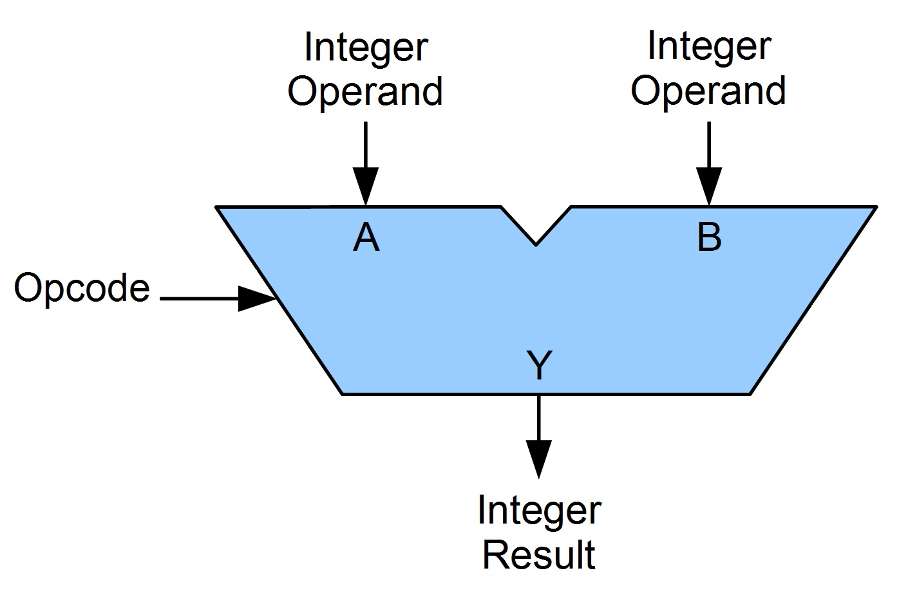
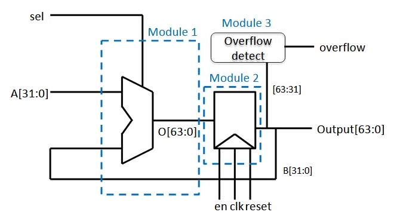

# Arithmetic Logic Unit (ALU)

**What is ALU?**

Arithmetic Logic Unit (ALU) is an integrated circuit in a CPU or GPU, which performs arithmetic and logic operations. The arithmetic instructions include addition, subtraction, multiplication, division, and shifting operations, while logic operations include AND, OR, XOR, and NOT operations.

**Operands:**

The inputs of an ALU are the data to be operated on, called operands, and a code indicating the operation to be performed; the ALU's output is the result of the performed operation.

**Opcode:**

The opcode input is a parallel bus that conveys to the ALU an operation selection code, which is an enumerated value that specifies the desired arithmetic or logic operation to be performed by the ALU.

------------------------------------------------------------
**Design Specifications:**

Reset is asynchronous.

CLK and En to the register are synchronous.

Input A is an unsigned with constraint, i.e., (31 downto 0).

Sel chooses the opertion **(Addition, Multiplication, Shift Left, Shift Right, Compare if Equal and Compare if Less than)** to be performed by the ALU.
\
\
**Module 1: alu:**

Combinatorial logic.

Use concurrent statements to create internal signals/buses that can be assigned outputs of various operations.

Use behavioral operators.

Use a multiplexor (conditional or selected signal assignment or case statement) to select the ALU output.
\
\
**Module 2: dff:**

Sequential logic, so need a synchronous "clk".

A register bank of 64 D flip flops.

Reset is asynchronous, so when its set, the register bank is cleared (ZEROed).

The register bank needs to be synchronous to the rising edge of the clock.
(If "en" is set, then the D flip flop capture input, else hold the contents of D flip flops).
\
\
**Module 2: overflow:**

Combinational logic that observes the output of the module 2, and detects if there is an overflow by looking for propagated 1s in the upper 32 bits.

When overflow is detected, the design should assert reset for one cycle.
\
\
**Testbench** (design_TB) has been provided to simulate and verify the design.

